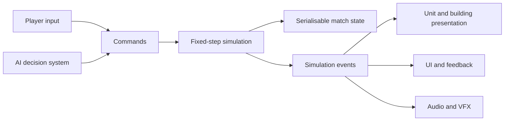

# Fracture Protocol — Planning Document

**Status:** Level 1 opening, Ranger/Raider balance, and authored Level 2 battlefield implemented; playtest both campaign missions next
**Version:** 0.8
**Target:** PC  
**Engine direction:** Godot 4  
**First playable:** Local skirmish against AI  
**Creative direction:** Original near-future military science fiction

This is a living design and production brief. It defines the first playable target without pretending that the long-term game is already fully designed. Decisions can be revised as soon as a prototype gives us better evidence.

### Verified prototype slice

The current Godot 4 prototype has a playable local skirmish foundation:

- A bounded 3D tactical camera with keyboard/edge pan, zoom, and limited rotation.
- Drag selection, context-sensitive move/attack orders, production queue input, relay placement, a minimap, and event feedback.
- A fixed-step simulation with commands, events, serialisable dictionaries, base structures, units, capture points, resource income, production, combat, and a basic AI opponent.
- Obstacle-aware movement around the authored graybox map, attack-move orders that resume after contact, and a stop order that clears the current route.
- Shift-right-click appends serialisable movement waypoints, while `P` patrols between the current position and a chosen destination.
- Control groups with keyboard focus support, plus visible destination markers and order labels for selected units.
- Damage events now produce procedural combat tracers, impact flashes, damage readouts, and destruction bursts without requiring final assets.
- A connected supply network that begins at the Command Hub and can extend through completed Forward Relays and owned control points.
- Unsupplied units receive a readable warning plus reduced movement speed and combat damage until they reconnect.
- Automated verification for movement, supply loss and recovery, relay construction, territory capture, production completion, combat damage, technology gating, and repair orders.
- A Collector unit links a named resource source to a specific refinery, carries cargo visibly between them, generates delivery income, and retreats to its Command Hub while defending itself when attacked. The player can queue replacement Collectors, select one, press `U`, click a resource field, and click a specific friendly Resource Processor to reassign its route.
- Advanced Targeting research at the Assembly Bay visibly gates Bulwark production, while paid repair orders restore damaged units near repair stations or damaged structures in place.
- The AI now uses the same command/economy boundary to research, repair, build relays, replace and route Collectors, produce forces, defend threats, and launch attacks. `N` resets the match without stale entities or orders.
- The HUD now gives first-minute objective guidance, explains the credit/supply/research/repair tradeoffs, exposes production queue status, and gives explicit Collector route controls.
- The central relay corridor has a first code-native visual slice: signal core, pulsing halo/light, and readable road markers that can later receive final assets.
- Explicit Move orders now override attack pursuit while still allowing fire against remembered or newly detected enemies that remain in range.
- Ranger and Raider now share first-pass health, armour, range, damage, and fire cadence; Raider identity remains speed/vision rather than raw combat superiority. Level 1 begins without an enemy Bulwark and the AI waits for a three-unit attack group.
- The campaign opening is regression-covered as a Hub-only Level 1: loss does not unlock Level 2, restart clears match state, and a Level 1 win persists the Level 2 unlock.
- Relay Crossroads now uses its own 280×184 authored battlefield with separate roads, obstacles, energy placement, deployment coordinates, and relay approach lanes. Switching missions rebuilds the authored world shell and minimap bounds from the selected level data.
- Unit presentation interpolates between fixed simulation positions, while destination markers continue to track the authoritative simulation target.
- Collector loading now fills over a readable 2.5-second interval and exposes a distinct cargo progress bar below its health bar.
- Construction visuals remain grounded at every progress value: the body grows upward from the terrain and its cap, antenna, health bar, and label follow the current top.
- Production now uses a five-item queue cap, slower authored build pacing, explicit exit anchors, selectable Assembly Bay rally points, and visible queue/force-limit feedback.
- The authored `data/level_data.json` schema now drives the first skirmish's bounds, roads, lane markers, obstacles, accents, resource fields, capture points, player/enemy spawns, AI coordinates, and per-level caps/timing rules.
- Unit and building health fills are aligned to their backgrounds at full health; Collector cargo remains a separate progressive bar.
- Automated scenario coverage now includes Collector management, AI behavior, rush/turtle/greedy/tech-first/unit-first/Collector-loss/supply-cut paths, clean restart, the focused movement/presentation regression, authored terrain loading, queue limits, rally exits, force caps, Ranger-Raider parity, queued waypoints, patrol looping, and a 100-unit simulation benchmark.

- Supply-connected captured control points now become Forward Staging Sites: they support the existing paid field repairs, provide a named Assembly Bay rally destination, visibly go offline when cut, and restore the saved rally when reconnected. West Crossing teaches the player mechanic while the AI secures East Crossing using the same rules.
- Relay Divide now has an expanded 160×110 authored battlefield, a player-base opening camera, a visible tactical minimap, and a world-space objective beacon. Mission briefing and objective copy are data-owned in `data/level_data.json`, keeping map/story text out of gameplay scripts.

The next iteration should playtest both authored campaign missions, verify Ranger-Raider parity under real combat pressure, and tune staging-site pressure, queue pacing, force caps, rally placement, Collector risk/reward, and AI attack timing before adding more units or faction-specific economy. Asset work can proceed selectively around the representative relay corridor rather than replacing the whole graybox at once.

## 1. Vision

Create a polished, readable real-time strategy game that combines the immediate base-building and battlefield control of classic Command & Conquer-style RTS games with a modern 3D presentation and a meaningful logistics layer.

The player should constantly make decisions at three connected levels:

1. **Economy:** What should be built, upgraded, or saved for later?
2. **Territory:** Which resource sites, roads, relay points, and defensive positions matter right now?
3. **Combat:** Which units should move, fight, flank, scout, retreat, or be sacrificed to create an opening?

The game should feel familiar within its first few minutes, but it should not be a direct recreation of an existing franchise. Factions, names, terminology, fiction, art, interface styling, maps, audio, and assets must be original.

## 2. Reference and Design Intent

The supplied [Red Alert Remastered gameplay reference](https://www.youtube.com/watch?v=OSoC3ei1Hzo) is useful for the intended match rhythm: establish a base, expand production, issue direct orders, and turn economic advantage into battlefield pressure.

The [Command & Conquer overview](https://en.wikipedia.org/wiki/Command_%26_Conquer) highlights the genre conventions that are worth studying rather than copying:

- Build a base that unlocks additional technology and production.
- Acquire a battlefield resource and convert it into credits or construction capacity.
- Use infantry, vehicles, and later specialist forces with clear counter relationships.
- Make faction identity visible through different unit properties, structures, and abilities.
- Give the player a readable interface for construction, production, selection, orders, and battlefield information.
- Support skirmish AI as a first-class mode, with campaign and multiplayer as possible later extensions.

The design goal is **classic strategic clarity with modern presentation**, not maximum simulation complexity.

## 3. Creative Direction

### Working premise

In a near-future world where regional infrastructure has fractured, two military powers fight over autonomous energy and communications networks. The conflict is decided less by who owns the most land and more by who can keep the battlefield supplied and connected.

The premise supports familiar RTS actions—harvesting, construction, technology, production, and combat—while giving territory and logistics a stronger strategic role than a conventional resource race.

### Working factions

These names and details are placeholders for refinement.

#### The Aegis Directorate

A centralised, network-dependent coalition with advanced sensors, precision weapons, strong defensive infrastructure, and expensive specialist units.

- Strengths: information, range, precision, fortified bases, efficient connected supply.
- Weaknesses: costly units, vulnerable relay network, slower recovery when infrastructure is cut.
- Strategic identity: control the map through sensors, relays, and carefully supported combined-arms formations.

#### The Frontier Compact

A distributed military alliance built around mobile logistics, salvage, adaptable field engineering, and inexpensive forces.

- Strengths: mobility, rapid forward depots, cheap replacement units, raiding, recovery from damaged infrastructure.
- Weaknesses: less efficient high-end technology, weaker static defenses, lower individual unit quality.
- Strategic identity: create several local advantages, attack supply lines, and turn captured territory into forward momentum.

The factions should share enough roles that the game remains teachable, but their economies, production choices, and logistics tools should create different strategic decisions.

## 4. Core Gameplay Loop

The intended match loop is:

```text
Scout the battlefield
        ↓
Secure resource sites and territory
        ↓
Build a connected base and supply network
        ↓
Research technology and produce forces
        ↓
Attack, defend, raid, or disrupt logistics
        ↓
Convert territorial advantage into a decisive assault
```

### Match opening

The player starts with a command headquarters, a construction capability, a small defensive or scouting force, and a nearby resource opportunity. The opening should ask a meaningful question quickly: expand toward income, establish a safer base, or contest the opponent's route.

### Mid-game

The player should have enough information to form a plan but not enough certainty to play passively. Control points, relay sites, resource fields, and terrain routes should create reasons to move the army rather than simply turtling behind the main base.

### End-game

The winner should usually be the player who has turned economic and territorial advantage into a coordinated attack. A match should not require destroying every last unit after the enemy's command network has clearly collapsed.

## 5. Battlefield and Camera

- Use a bounded 3D-isometric camera rather than a fully free-flying camera.
- Support mouse-edge or keyboard panning, zoom, and limited rotation within readable bounds.
- Keep the battlefield legible at the default tactical height.
- Use terrain elevation, roads, cover, chokepoints, resource fields, and relay positions to shape decisions.
- Keep important gameplay information visible through silhouettes, selection rings, team colours, health bars, and clear order indicators.
- Use close camera zoom for presentation and inspection, but do not require close zoom for precise play.

The camera is part of the competitive design. Visual spectacle must never hide a selected unit, make an order ambiguous, or prevent the player from understanding why an attack failed.

## 6. Economy, Territory, and Logistics

### Primary resource

The MVP uses one primary battlefield resource. Resource sites are visible after scouting and are collected through dedicated structures or field assets. The resource is spent on construction, production, research, repairs, and faction-specific abilities.

The first economy should remain simple enough that players can understand the cause of a shortage. Additional currencies, global income, or complex upkeep should wait until the first skirmish is fun.

### Collector loop

A Collector is assigned to a named resource source and a specific refinery. It travels to the source, loads a finite cargo amount, and visibly returns to the refinery before the credits are delivered. Collectors have health, a light weapon, and a limited defensive response: taking damage switches the unit to a retreat route toward its Command Hub while it continues firing at enemies within range. New Collectors begin unassigned, are produced through the normal Assembly Bay queue, and can be manually routed with a two-step source-then-refinery order.

### Technology and repairs

The first technology choice is Advanced Targeting. The Assembly Bay researches it for a visible time and credit cost; completion unlocks Bulwark production. Repair is deliberately paid and local: damaged units must be brought near a Command Hub, Resource Processor, or Forward Relay, while damaged structures can be restored in place. This creates a readable choice between protecting an asset long enough to recover it, spending credits on recovery, or replacing it.

### Territory

Territory is represented by strategically important map locations rather than an abstract ownership overlay alone.

Examples include:

- Resource sites.
- Relay or communications positions.
- Forward deployment areas.
- Road junctions and chokepoints.
- High-ground observation points.
- Repair or salvage locations.

Capturing a location should provide a visible advantage, such as safer supply, improved vision, faster deployment, or access to a resource route.

### Supply network

Supply is a network or area state, not a per-unit ammunition spreadsheet in the MVP.

- The command headquarters and relay/depot structures form the network.
- Connected territory provides normal reinforcement, repair, and faction benefits.
- Units outside effective support become **unsupplied** rather than instantly useless.
- Unsupplied forces may suffer reduced repair, slower reinforcement, weaker ability recharge, or reduced combat efficiency.
- Reconnecting a relay or establishing a mobile depot should visibly restore the network.
- The UI must explain both the current state and the cause: for example, “Unsupplied — enemy control point severing eastern relay.”

This system makes map control matter without forcing the player to manually reload every individual unit.

## 7. Base Building and Technology

### Construction

The command headquarters or mobile construction capability is the primary construction source. Buildings are placed within a valid construction radius or connected build area so the base grows spatially and can be attacked from multiple directions.

The placement rules should be generous enough to keep the game moving while still making defensive layout and forward expansion meaningful.

### Initial structure roles

The first playable build should target a compact set of roles:

- Command headquarters.
- Resource processor or refinery.
- Power or infrastructure provider.
- Infantry production building.
- Vehicle production building.
- Relay or forward depot.
- Defensive turret.
- One technology or upgrade structure.

These are roles, not final names. Each faction may express them differently.

### Technology

Structures act as technology gates. Destroyed or disconnected infrastructure can temporarily remove access to higher-tier production or abilities.

The MVP should use a small, visible progression:

1. Basic economy and infantry.
2. Vehicles and improved defenses.
3. Specialist units or faction-defining abilities.

Avoid a large research tree until the basic production and combat loop has been tested.

## 8. Units and Combat

### Initial unit roles

Each faction should begin with approximately five unit roles:

1. Basic infantry or general-purpose force.
2. Anti-armour or hard-target specialist.
3. Main battle vehicle.
4. Artillery or long-range support.
5. Scout, raider, or utility unit.

The final roster can add faction-specific roles later. Each unit needs a clear purpose, a readable counter, and a reason to exist beyond being a stronger version of another unit.

### Orders and controls

The MVP should support:

- Click and drag selection.
- Shift-select and control groups.
- Move, attack, attack-move, patrol, stop, and retreat/withdraw where appropriate.
- Queued waypoints and production orders.
- Building placement and cancellation.
- Context-sensitive orders for capture, repair, resupply, or salvage.
- Minimap navigation and camera focus on selected units.

### Combat principles

- Use readable counter relationships rather than hidden statistical complexity.
- Make range, armour, damage, accuracy, speed, and terrain interaction visible through feedback.
- Provide clear hit, miss, damage, destruction, and suppression effects.
- Give units response delays and acceleration that feel physical without making control frustrating.
- Use authored damage states and selected destruction effects for the MVP; full physical destruction is out of scope.

## 9. User Interface and Feedback

The interface should communicate the answer to three questions at all times:

- **What is selected or happening?**
- **Why can or cannot the player perform an action?**
- **What should the player consider next?**

Initial interface areas:

- Battlefield and selection feedback.
- Construction and production panel.
- Resource, power, and supply status.
- Minimap with meaningful icons and territory state.
- Selected-unit information and command card.
- Event notifications for major attacks, supply loss, completed structures, and destroyed infrastructure.

Warnings should be actionable. “Insufficient resources” is less useful than “Need 120 more credits; refinery income is reduced because the northern field is disconnected.”

## 10. Simulation and Technical Foundation

The game should keep rules and presentation separate from the first prototype.



### Data-driven definitions

Use Godot `Resource` assets or an equivalent data-driven layer for:

- `FactionDefinition` — faction identity, colour, starting rules, technology modifiers, and logistics abilities.
- `UnitDefinition` — role, costs, build time, movement, health, armour, weapons, prerequisites, and supply behaviour.
- `BuildingDefinition` — footprint, construction rules, power/infrastructure contribution, production, research, and prerequisites.
- `WeaponDefinition` — range, damage, rate of fire, damage type, targeting rules, and effects.
- `TechnologyDefinition` — prerequisites, cost, unlocks, and faction restrictions.
- `MapObjectiveDefinition` — capture rules, territory effects, resource output, and visual representation.

### Command boundary

Player input and AI decisions should produce commands rather than directly modifying units.

Initial command types:

- `MoveCommand`.
- `AttackCommand` and `AttackMoveCommand`.
- `BuildCommand`.
- `ProduceCommand`.
- `ResearchCommand`.
- `AssignCollectorCommand`.
- `CaptureCommand`.
- `RepairCommand`.
- `StopCommand`.

Commands should contain an issuing player/faction, a simulation tick or order sequence, selected entity IDs, and a typed payload. Invalid commands should be rejected with a reason that the UI can explain.

### Event boundary

The simulation should emit events for presentation and diagnostics rather than calling visual systems directly.

Initial event types:

- ResourceCollected.
- ResourceDelivered.
- CollectorAssigned.
- CollectorRetreating.
- `UnitDamaged`.
- `UnitDestroyed`.
- `UnitRepaired`.
- `BuildingRepaired`.
- `ResearchStarted`.
- `TechnologyUnlocked`.
- `BuildingCompleted`.
- `BuildingDestroyed`.
- `ResourceChanged`.
- `SupplyStateChanged`.
- `TerritoryCaptured`.
- `ProductionStarted` and `ProductionCompleted`.
- `OrderRejected`.

Every event should include enough context for logs and UI feedback without requiring presentation code to query internal simulation details unnecessarily.

### Match state

The match state should be serialisable for test fixtures and future saves. It should include:

- Current simulation tick and random seed.
- Player/faction ownership.
- Resources and production queues.
- Entity transforms, health, orders, and statuses.
- Building construction and technology state.
- Territory ownership and capture progress.
- Supply graph or connected-network state.

Networking, campaign saves, and replays are not MVP features, but keeping a clean state/command/event boundary avoids making them impossible later.

## 11. AI Direction

The first AI should be intentionally understandable rather than omniscient.

It should be able to:

- Gather and spend the same primary resource as the player.
- Build a basic base and production chain.
- Scout or reveal important map locations.
- Capture or contest territory.
- Establish relays or depots.
- Defend threatened infrastructure.
- Form and send simple combined-arms attack groups.
- Recover when a supply route is cut.

The AI should not receive hidden resource bonuses in acceptance tests. Difficulty can later change planning speed, risk tolerance, scouting quality, and tactical execution rather than simply granting unfair income.

## 12. Visual and Audio Direction

### Visual target: high-end stylised realism

- Detailed but coherent materials for military hardware, infrastructure, roads, terrain, and damage states.
- Strong silhouettes and faction colour accents that remain readable at tactical zoom.
- Modern lighting, atmospheric depth, environmental motion, and restrained post-processing.
- Distinctive weapon VFX that communicate range, impact, and damage type.
- UI styling that belongs to the setting without reducing information density.
- Animation that sells weight, turning, suspension, recoil, construction, and destruction.

The first art milestone should polish one small map area, one base, and a representative unit group rather than attempting final art for the entire game.

### Audio target

- Distinct faction audio language.
- Clear order acknowledgements and warnings.
- Weapons differentiated by role and scale.
- Ambient battlefield sound that supports, rather than competes with, important feedback.

## 13. MVP Boundary

### Included

- PC local skirmish.
- One authored map.
- Two playable factions.
- One primary resource.
- Base construction and placement.
- Production queues and basic technology gating.
- Territory capture and supply/logistics networks.
- Infantry, vehicle, artillery, and scout/utility roles.
- Basic AI opponent.
- Destruction of the enemy command headquarters as the main victory condition.
- Playable graybox presentation followed by one polished representative slice.

### Explicitly deferred

- Online multiplayer.
- Full campaign production and branching narrative.
- Persistent progression or metagame.
- Air and naval warfare.
- Full environmental destruction.
- Modding tools and map editor.
- Multiple resources or complex upkeep systems.
- Cinematic production and full-motion video.

## 14. Production Milestones

### Milestone 1 — Command and combat graybox

Deliver a map where the player can move the camera, select units, issue orders, navigate obstacles, attack targets, and understand combat results.

### Milestone 2 — Economy and base building — graybox complete

Resource collection, explicit Collector assignment/replacement, construction, production queues, technology prerequisites, repairs, and the HQ win/loss condition are playable and regression-tested.

### Milestone 3 — Territory and logistics — graybox complete

Capture points, relays, supply state, disruption, reconnection, and territory-driven choices are implemented in the shared simulation.

### Milestone 4 — AI skirmish — first pass complete

The AI builds, researches, repairs, replaces Collectors, produces, defends, attacks, and uses the same command/economy rules as the player.

### Milestone 5 — Representative visual slice — first pass started

The central relay corridor has a code-native signal-core treatment and lane markers. The next pass can replace this treatment selectively with authored assets, animation, audio, and VFX without changing the gameplay contract.

### Milestone 6 — Hardening and evaluation — active

Scenario tests, clean restart coverage, first-minute guidance, and the 100-unit simulation benchmark are in place. The next review must tune match pacing and verify the actual 60 FPS visual baseline on the chosen PC hardware.

## 15. Acceptance Tests

### Controls and battlefield

- The player can pan, zoom, and rotate within bounded camera limits.
- Drag-selecting a group selects the intended units without selecting unrelated units.
- Move, attack, attack-move, stop, patrol, and queued waypoint orders work reliably.
- Units navigate around obstacles and do not permanently stall in ordinary map conditions.
- Control groups and minimap navigation remain usable during combat.

### Economy and construction

- Resource income changes when a field, refinery, relay, or route is captured or disconnected.
- The player cannot spend resources they do not have.
- Buildings respect placement rules, construction time, prerequisites, and cancellation behaviour.
- Production queues communicate cost, time, progress, completion, and rejection reasons.
- Destroyed prerequisite structures correctly affect access to gated production or technology.

### Territory and supply

- A capture point changes ownership only under the defined capture rules.
- Destroying or capturing a relay visibly changes the supply state of affected territory and units.
- Unsupplied units receive a clear explanation and measurable, understandable effects.
- Rebuilding or reconnecting the network restores the correct benefits.
- The supply system remains comprehensible when several routes are contested simultaneously.

### Combat and AI

- Unit counters are observable through results and feedback, not only hidden numbers.
- Damage, destruction, targeting, range, and line-of-sight rules behave consistently.
- The AI completes a basic build order, uses its economy, and can end a match.
- The AI does not require hidden income or perfect map knowledge to function.
- The match can be restarted cleanly without stale entities, resources, orders, or territory state.

### Presentation and performance

- Selection, health, orders, supply, capture progress, and important warnings remain readable at normal tactical zoom.
- The representative visual slice meets the stylised-realism target without obscuring gameplay information.
- The chosen PC baseline can sustain approximately 100 active combat units at 60 FPS in the MVP scenario.
- Major simulation events are logged well enough to diagnose a failed acceptance test.

## 16. Risks and Mitigations

| Risk | Mitigation |
| --- | --- |
| High-quality art hides weak gameplay | Require a functional graybox match before major asset production. |
| Logistics becomes annoying micromanagement | Model supply as a network/area state, not individual ammunition management. |
| Factions feel like reskins | Give each faction a different economic and logistics solution, not only different weapon stats. |
| Camera freedom hurts readability | Keep rotation and zoom bounded and test with real unit groups early. |
| AI development blocks the first prototype | Use a small rule-based AI with the same commands and simulation as the player. |
| RTS scope expands too quickly | Hold the MVP to one map, two factions, one resource, and a compact roster. |
| Future multiplayer becomes impossible | Keep simulation state serialisable and route all changes through commands/events from the start. |
| Performance problems arrive late | Add representative unit-count benchmarks before final visual production. |

## 17. Future Roadmap

After the local skirmish is proven, the likely order is:

1. Additional maps, balance, accessibility, and quality-of-life controls.
2. More faction depth and alternate territory objectives.
3. Campaign missions with authored objectives, briefings, and persistent progression.
4. Replay, observer, and advanced AI tooling.
5. Multiplayer feasibility prototype using the established simulation boundary.
6. Additional factions, environments, air/naval systems, and modding support only if the core game supports them.

## 18. Open Questions for the Next Revision

- What is the final setting, conflict, and terminology for the two factions?
- What is the primary resource called and what does it represent in-world?
- How strong should terrain, cover, elevation, and line of sight be?
- Should supply affect combat power directly, or mainly repair, reinforcement, and abilities?
- How much base expansion should be allowed away from the main headquarters?
- What is the target match length for a standard skirmish?
- Which art reference best defines the intended visual quality without compromising readability?
- What PC hardware should be the official performance baseline?

## 19. Recommended First Work Items

1. Run focused balance sessions against the new greedy, rush, turtle, tech-first, unit-first, Collector-loss, and supply-cut scenarios; tune costs, timings, and AI aggression from observed outcomes.
2. Do a first-time-player usability pass in the real window, checking whether the objective, queue state, Collector route, supply warning, and repair feedback are understood without reading the source.
3. Add faction-specific economic and logistics decisions only after the shared loop remains legible under balance pressure.
4. Expand the representative relay-corridor visual slice with authored materials, animation, audio, and VFX while preserving the current silhouettes and feedback.
5. Repeat the 100-unit benchmark with the visual slice active on the chosen PC baseline, then begin campaign/multiplayer feasibility work only after the local skirmish is stable.
